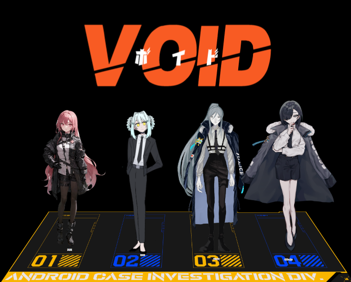
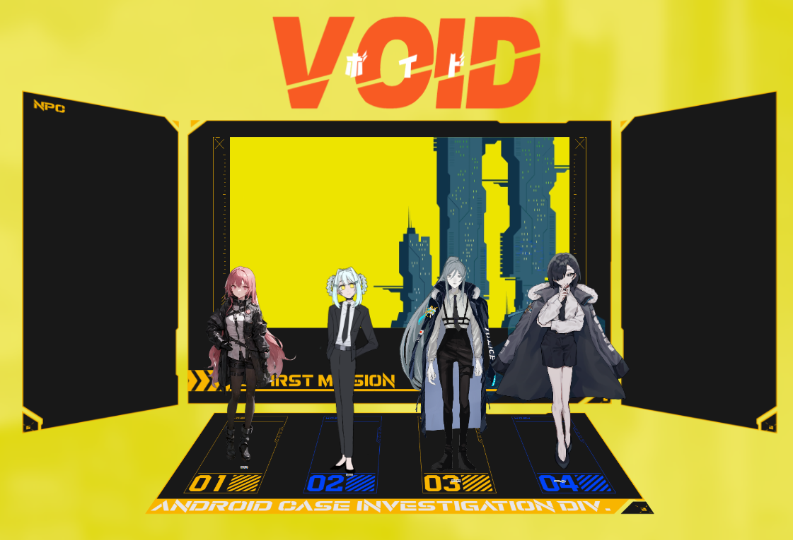
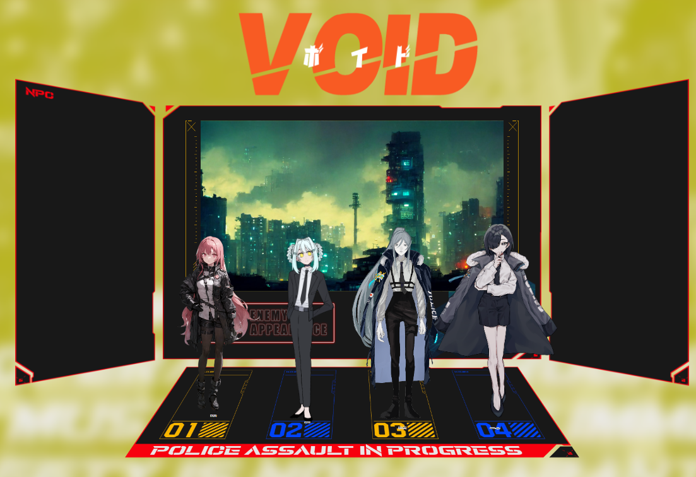
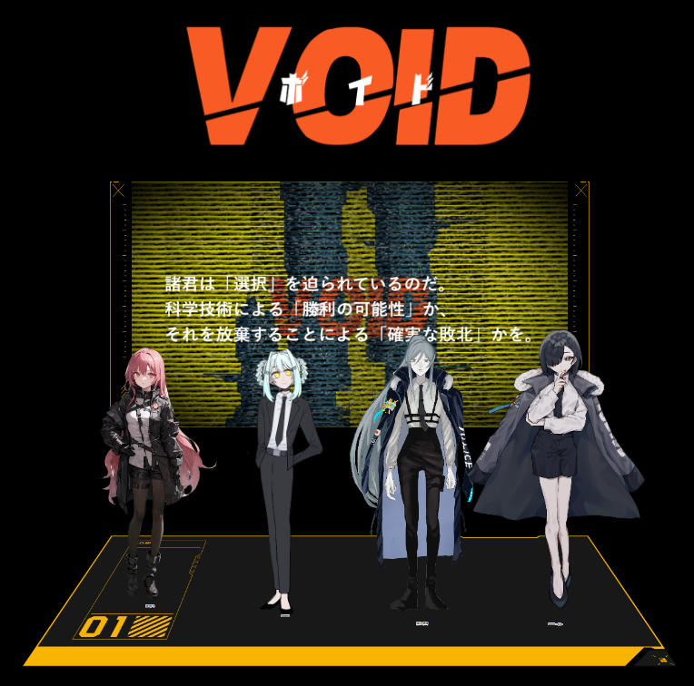
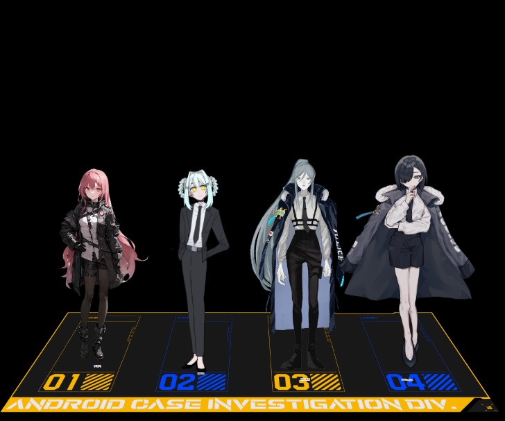

# **ネタバレあり。現行・未通過はNGです。**




## 概要

[クトゥルフ神話trpg VOID - myao - BOOTH](https://booth.pm/ja/items/2907962)を通過しました。20時間程度のシナリオと聞いていたけど計30時間前後はやりました。
時間の関係でエピローグを一部スキップしているので、それも後に行う予定です。

通過した感想は「最高」の一言。
シナリオ全体がとても良かった。本筋が伝わりやすいというのもあるし、苦しいシーンも熱いシーンも多くて、とてもとても良かったです。

記事にする内容は「VOID良いよ」「部屋がんばったんだ」「BGMとかすごいよ」「クレジットをここにも書くよ」という感じです。


## VOID

いわゆるサイバーパンク・アンドロイドものに属する世界観のシナリオです。

西暦2030年、リボット社という企業が史上初のチューリング・テスト(※1)をパスしたアンドロイド『VOID(ボイド)』を発表、それから2050年、VOIDが普及した日本において、アンドロイドによる連続殺人事件およびアンドロイドによる連続破壊事件が発生したという部分がベースとなっています。

自卓で回したときの公開情報はSimplenote([VOID 公開情報 (simplenote.com)](https://app.simplenote.com/p/9hkN3W))というサービスを用いてまとめていました。この公開情報にはシナリオのネタバレは存在しません。

作者の方があとがきやBoothにも書いていますが、『Detroit Become Human』と呼ばれるゲームの世界観に影響を受けたシナリオで、先にプレイしておくとより楽しくプレイできる気がします。
個人的に『Deus Ex: Human Revolution』や『Cyberpunk2077』、一部モチーフに『攻殻機動隊』などもシナジーがあると思っていて、それらに共通するようなテーマがあるなと感じ、楽しくなりながらプレイしていました。


# **以下はネタバレあり。現行・未通過はNGです。**


### どういうタイプのシナリオか

基本的には原点のCoCにあるような「理不尽さ」「名状しがたさ」というよりかは、「エモさ」という部分を体験するためのシナリオに分類されるかと思います。これはこのシナリオの良し悪しなどではなく感じた事実です。（結構気にする人もいると思うし）

ある意味ではTRPGのシステムとしては『エモクロア』などの方が適切かも、と考えるとややプレイヤーにとっても向き不向きがあるシナリオだとは思います。
筆者はこの「エモさ」を最大限活用するために全力全開出したので、最終的にPLが楽しんでいたら良かったなぁと思っています。

### シナリオ全体の感想

『選択』をすることがテーマの一つで、その選択に至るまでの過程……シナリオ・秘匿・NPCといった情報が綺麗につながっているシナリオでした。
この『選択』に至るまでの過程がとてつもなく美しく、最後に収束していく感覚が素晴らしい。一言で言えば「最高」という感じです。

KPが場を管理し、PL/PCに好きなだけRPをさせ、NPCを用いてそれをより盛り上げる。そうして得られた情報と感情を元に、PCに『選択』を突きつける。
まさにTRPGの本質ですが、この流れを20時間以上あるシナリオで綺麗に出せるのは……うーん、最高！！！！！！

かなり長いシナリオかつ、秘匿の管理とNPCの処理、そして流石にシナリオブック上で描写しきれないNPCの細かい言動などをシミュレートする必要がいくつかあるため、KP難易度はかなり高いように思いましたが、
KPもKPでアホほどテンション爆上がりイケイケモードになるので、回してて死ぬほど楽しかったです。

### HO1

『貴方は今年刑事になったばかりの新人だ。 この若さでの抜擢は異例である。』

秘匿としては、「VOIDに対して恐怖心を抱いている」「才能溢れる若手の刑事」という形で、シナリオ上はかなり複雑な過去を保持しているHOです。
その都合上シナリオが始まる前までに得る情報も設定も少なく、進行するに連れて情報が開示されていくという形になっています。

テーマとしては「家族」や「人間とアンドロイド」という部分が強く、HO2との過去を含め、その情報を把握した後に最初の状態から変わっていく、ある意味で王道とも言えるHOなのかなと思います。
最初がプレーンな状態から始まるからこそ、一番最後にPCの感情としてどのような『選択』をするのかを提示される。
いろいろな意味でVOIDというシナリオに深く関わるPCになるなと思いました。

自卓ではかなりキャラクタ作り・RPの方向性の部分で悩みがあったかと思いますが、明かされる真実に不器用ながらもPCが向き合ってもらえたと思っています。
個人的に、『選択』はPLの価値観と、このシナリオを経験したPCの価値観との間で必ずしも一致するとは思っていなかったので、そこの部分を悩んでもらえることそのものがこのVOIDというシナリオをしっかりと体験してもらえたのかな、と思って嬉しくなっていました。

（あと、最後の選択に出てきた人のRPをしていた時にめちゃくちゃ楽しかったです。邪悪KPプレイング。）

### HO2

『貴方はHO1のパートナーロボットだ。 最新型の機能が揃えられている。』

秘匿としては「人の死に強い恐怖感を抱く」「とある手術の夢を見る」「ウィルスと名乗る存在と会話することがある」という形で、これもまたかなり複雑な過去を保持しているHOです。

こちらもHO1と同じく、テーマとしては「家族」や「人間とアンドロイド」という部分が強く、しかしHO1よりもより強烈にその事実を叩きつけられ、かなりエグめですがギリギリ王道という感じのHOかなと思います。
自身のアンドロイドとしてのキャラ作成時の意志と、明かされていく真実との間で板挟みになる中で『選択』を提示される。その選択次第で結果が決まっていく、VOIDというシナリオに深く関わるPCだな～とこちらも思いました。

自卓では、上記の部分で強く悩みを抱え、その部分のフォローとしてNPCとの会話を追加したり、『選択』に関してもより流れに沿った形に変化させ、より深い部分の意志を聞きにいったりしました。
めっちゃ難し～～～～～～～～と思いながらもPL/PCの情報を整理して課題を抜き出しつつ、どれだけ追い詰めた『選択』を提示できるかずっと考えてました。
結果として元々の文章描写からかなり異なった「青木」というNPCにはなっているんですが、それをPCの解釈・RPの糸口の一つとして大事にしてくれたと思います。
KP的に気になった部分に関してもPL/PCとしてふせったーで定期的に自身の考えをまとめていただけたり、こちらの質問もちゃんと考えて頂けたし、そうした盤外戦術も含めてVOIDに向き合えたからこそ満足度のとても高い体験ができたんじゃないかなと思っています。

たぶんこの卓でしか、ここまで悩むHO2は見られなかったと思います。それ故にとっても嬉しい。
悩んでくれて、向き合ってもらえてありがとうございました。

### HO3

『貴方は他の課から移動してきた刑事だ。 今まであらゆる事件を解決してきたことだろう。』

秘匿としては「10年前からの過去を持つ」「NPCと極めて強い関わりがある」という形で、そしてそれ故に白瀬兄弟にめちゃくちゃ情緒をぐちゃぐちゃにされる、いろんな意味ですごい面白さを持ったHOです。

HO1、HO2とはそもそもの出自や設定(30代限定とか・特別な立場とか)の違いがあり、真相が明らかになるにつれて自身しか知らない事実との関連性を考える必要もありますし、いろんな立場・価値観との板挟みになり、考えることが最初からかなり多いHOかなと思います。
ただ、シナリオが進むにつれて細かい選択を繰り返し、降りかかるものを背中に抱えてながらも、一つの真実・するべきことに進んでいくという、HO1-2とは対極の立場を取っています。
そういうのが似合いそうなPLの方に、KPが何も言わずにおすすめするとめちゃくちゃ楽しくなると思います。必須条件としては白瀬兄弟と相性がよさそうなPCかどうかは考えておくと良いでしょう。

自卓では、もうびっくりするぐらい適切なPL/PCに当てはめられたので、白瀬兄弟をKPが演じるのがヤバいぐらい楽しかったです。
このHO3は、HO4およびNPCに適切な感情を抱いていなければちゃんと苦しんだり悩んだりしてくれないと思うので、KPは白瀬兄弟のRPを自身がPC参加している感じで行っていたんですが、本当に相性が良くて、存在しない個別描写のシーンや、探索中にどんどん関わっていく描写が出たりと、キャラクタが勝手に動いてる感じがKP側もしていて楽しかったです。
まぁそうして描写したからこそ『選択』にものすごく苦しんだと思いますし、背負うものがとても多くなったかと思いますが、それ含めて楽しんで頂けたなら幸いです。

（ダイスの出目の調子がすんごい悪かったり、HO4と一生イチャコラしたりと、なかなかこの卓ならでは感もおもろかったな。）

### HO4

『貴方はHO3のパートナーロボットだ。 HO3を信頼し、アンドロイドとしてサポートをしてきた。』

秘匿が最も特殊であり、「SPARROW(スパロー)という組織のスパイ」「特定のNPCたちとの強い関わり」という、秘匿情報山盛り、明かされる過去山盛り、さらに『選択』も最速という、鬼盛りメガ定食みたいなHOです。

いろんな意味でHO4のみが抱える悩みは最初から大きく、真実が判明するにつれ自身の正体やシナリオの事実との関係も判明していく、その中で立ち回り・考えに注意する必要もある、ある意味KPに求められるような情報管理が必要な特殊なHOかなと思います。
人によって大きく反応が変わりそうで、なんでも許せるタイプの人じゃないとめっちゃ悩んだりしそうだなと思っていました。

ただ、自卓では強い信念を持っていて、前半は情報を得ながらもそれを殆ど悟らせないRPの上手さが、後半ではそれらを理解した上でもするべき事にまっすぐに向き合う姿が印象的でした。
故に『選択』の場面においても最速で自身のやりたい事を選んでもらえたし、それに応えられるような部屋を出せ、さらにはダイスまでキマっていて全部バチバチにハマっていたので、とても嬉しかったです。このシーンの時点で満足度100%超えてた気がします。

いろんな意味で、とても満足度の高いRPをできたと思っているので、エンジョイして頂けたならとっても幸い。

## 部屋の努力と注意

### ココフォリアの部屋

今回のVOIDの部屋は「山場を可能な限りPC/PLにブチ当て、インパクトと同時にシナリオの流れを理解させる」ということを強く意識しました。
つまるところ、「エモ！！！！！！！！！！！！！」と思ってもらえることを極めて重視していました。それゆえ、「前景・背景を用いて場面変化を徹底的に教える」「動きをつけ、メリハリを演出する」「全力で戦闘を楽しめるようにする」という感じを想定していました。
そうすることで、PCの感情が激エモになり、その当時のことを強く覚えてくれるだろうし、それが最終的に『選択』をこれまでの経験から導き出せると考えました。

……という感じでいろいろやっていた結果、部屋のシーン数は驚異の300シーン超えを記録しました。一つの基本のフレームを流用していたので、想像よりかは手間はかかっていないと思いますが、結果としては極めて上手く演出できたんじゃないかなと思います。

演出にはいくつかのパターンがあり、「調査」「戦闘」「選択」と少し特殊な「イントロ・エンディング・最終シーン用フレーム」の4つをうまいこと組み合わせていて、それがフレーム的にうまくいったんじゃないかなと思っています。

-   調査



-   戦闘



-   選択



-   イントロ・エンディング・最終シーン



こだわりポイントですが、場面によって足元のパネルの内容を変化させたりと、「システム的に何かが変化している」という演出を組み込むことで、状況描写としてもわかりやすくて良かったなと思いました。
背景の色をスムーズに変化させるために、サイズ縦横1000、優先度0 or 100(キャラクタよりも優先度が高い)設定にしたマーカーパネルを用意し、それを用いて遷移に使ったりと、ココフォリアの仕様っぽい部分をフル活用しています。

私はデザインに関して詳しい訳でもなく、ただココフォリアに関してはかなり細かい場所含めてこだわりを追求できる性格ではあったので、既存素材をうまく組み合わせていくことで、長時間シナリオにも関わらず細かく変化していく、自慢の部屋が作れたな～と感じています。
殆どはこうした素材を公開・販売しているTRPGプレイヤーの方々のおかげです。この記事の最後にクレジットを記載しますが、本当に感謝してもしきれません。

特に、一部シーンにおける状況を極めて正確に伝えられるという意味で、VOID二次創作の素材もいくつか利用させて頂いています。

-   DMで連絡した上で、[ぽいぴく上のスチル](https://poipiku.com/2954854/6738103.html)利用を快諾していただいた『向島ワタル([@kkpa1726](https://twitter.com/kkpa1726)』さま
-   基本自由利用可能の形で[Pixiv上で配布]((https://www.pixiv.net/artworks/100864462))頂いていた『ひすいさま』
-   [Booth](https://booth.pm/ja/items/4430888)にてNPC素材を配布して頂いていた『pheno15』さま
-   同じく[Booth](https://booth.pm/ja/items/3855778)にてルート分岐時のAPNG素材を配布して頂いていた『天楽町図書館 館長』さま

本当にありがとうございました。


### KPが最も気をつけた部分

このVOIDというシナリオを回すにあたって、最も気をつけた部分は『選択』に関する描写です。最初にも書いたように、VOIDは『選択』をすることがテーマの一つとなっています。

この選択はHOによって分かれますが、いずれも2択であり、明示的に選択肢が与えられます。シナリオブック上では以下のような形の秘匿を送るように指示されます。

```
貴方は選択しなければならない。
(選択肢1)
(選択肢2)
この選択に正解不正解はない。
選ぶのは貴方自身だ。
```

いずれの選択肢も、そのHOにとってターニングポイントとなる選択です。それが如何に重要であるかを認識し、その上で迷い、決定するまでの流れ。それこそが、VOIDというシナリオの中で一番のカタルシスを得られる部分です。

これを如何にして演出するかが、KPをするときに求められる最重要課題であり、シナリオ通過後の満足度に直結すると感じました。
そのため、上記のような形で部屋を工夫しストーリーの上の山場などを表現しきって理解させること。あらゆる方法でPCに積極的なRPをさせ小さな選択をさせ続けることをかなり徹底し、時間的余裕がある限りその方針を崩さずに行いました。（結果として30時間かかりましたが……）

『選択』の場面であることを理解させるため、部屋に大きなパターンの変化をつけ、その場面の雰囲気だけでプレッシャーを与えたりと、いろんな部分でそこを各HOの到達地点として演出し続けられたのかな。と思っています。

自卓においては、提示される選択肢がPL/PCの状態と外れてしまうところもあったため、KP判断で『選択』を一部その場で変更するというなかなかとんでもないこともやっていました。
PL/PCの状態を適切に管理すること、その人に刺さるようにRPを修正し続けることが求められるので、ここを考えるだけでも相当時間を使う高難易度シナリオだな～と思っています。

だから、そこは多分うまくいってるっぽいなと思ったので、自分としては満足しています。

### BGM

VOIDの部屋作りの上で、印象的なBGMを用意するのがひっっっっっじょうに楽しかったので、今後もここはこだわっていこうと思いました。

基本的なシーンではSynthWave系統楽曲を用い、曲調の明るさ・暗さで雰囲気を表現。
緊迫したシーンでは、その法則から少し外れ、テンポを早めたDarkSynth系統を中心。
そして戦闘シーンでは、カッコよさに全力投球できるようにDrum and Bassを中心。
また、ラストシーンはもうボーカル入り楽曲まで突っ込んだりして、趣味全開で選びまくりました。

ここは個人的に書こうと思えばずっと語れますが、多分無限なので少し箇条書きにしてまとめて終わりにします。

-   HOの個別導入ごとにBGMを変化させ、その真相が明らかになるタイミングでも同じ曲を流したり
-   ブラウンノイズや無音を活用することで、BGMがより目立つように工夫したり
-   適切な場面でSEを再生して、よりわかりやすい情報源にしたり
-   戦闘曲はすべてループできるよう加工し、疾走感を出したり
-   そもそも戦闘シーンごとに全て曲が違うとかいうとんでもない部屋だったり
-   etc...


## クレジットと感謝

[クトゥルフ神話trpg VOID - myao - BOOTH](https://booth.pm/ja/items/2907962)

**到着ルート**

- 導入(個別・ペア)
- 立てこもり事件
- 街の捜査
- 柊の逮捕・救出
- 『X000 - れい』による選択 - 救援要請
- SPARROW
- 『深口 氷彗』による選択 - リーダー
- 最終決戦 - 立ち向かう
- 『BR800 - こがね』による選択 - 手を取らない
- 『柊 莉乃』による選択 - 拒否

**PC**

- HO1: 柊 莉乃
- HO2: BR800 - こがね
- HO3: 深口 氷彗
- HO4: X000 - れい

**NPC**(画像ありのみ抜粋)

- 黒田 矢代
- 赤星 透也
- イチハ
- 青木 玲斗
- レミ
- 黄海 夏央
- シロウ
- 白瀬恭雅(キョウ)
- 白瀬心
- 葉加瀬理兎(リト)
- 葉加瀬二兎(ニト)
- 大月ミミ
- 文月日佐人(ひさと)
- 雨宮智美(さとみ)
- 鳴宮久緒(くお)
- 天城圭一
- 有馬真二

**BGM**
MainTheme: Cyberpunk_City / PeriTune
https://peritune.com/blog/2020/05/22/cyberpunk_city/

City-Ambient-Light1: Neon Waves / MFP
https://dova-s.jp/bgm/play15355.html

City-Ambient-Light2: Empty City / White Bat Audio
https://www.youtube.com/watch?v=-RKdgBUaxJ4

City-Ambient-Light3: Last Stop / White Bat Audio
https://www.youtube.com/watch?v=jZoFzZ8pBmg

City-Ambient-Dark1: City of Drones  / White Bat Audio
https://www.youtube.com/watch?v=qYTHZCBpycg

City-Ambient-Dark2: Cursed  / White Bat Audio
https://www.youtube.com/watch?v=Xa0uLIvoKJU

City-Ambient-Investigate1: The Dead / John Tasoulas
https://soundcloud.com/john-tasoulas/the-dead

City-Ambient-Investigate2: The Chase / White Bat Audio
https://www.youtube.com/watch?v=wgT1fqjXfmQ

City-SPARROW: Hackers / White Bat Audio
https://www.youtube.com/watch?v=NZ4Of3lID84

Pressing1: Legal Weapon / Tanchiky (From Stream Palette)
https://diverse.jp/dvsp-0245/

Pressing2: Decimation / Crayvxn (From Stream Palette 2)
https://diverse.jp/dvsp-0256/

Pressing3: Cyber_Noir / PeriTune
https://peritune.com/blog/2021/08/31/cyber_noir/

Paganini: Paganini Caprice-24 / Steinaco (From Wikipedia)
https://ja.wikipedia.org/wiki/%E3%83%95%E3%82%A1%E3%82%A4%E3%83%AB:Paganini_Caprice-24.ogg

WhiteRoom: RainDrop / PeriTune
https://peritune.com/blog/2022/07/11/raindrop/

Memory: Home / White Bat Audio
https://www.youtube.com/watch?v=QTsJBDX7G2o

LastScene: Cyberpunk_City_Remix / PeriTune (KPにより加工)
https://peritune.com/blog/2020/05/22/cyberpunk_city/

"The Machine - Tick-Tock-Man": NyanNyathotep / -45 (KPにより加工) (From BlackLotus)
http://malie.noor.jp/

Battle1: Aim / Feryquitous (KPによりループ加工) (From Stream Palette)
https://diverse.jp/dvsp-0245/

Battle2: Moving Into Position / Maozon (KPによりループ加工) (From Stream Palette)
https://diverse.jp/dvsp-0245/

Battle3: Ocean Invaders / Jerico (KPによりループ加工) (From Stream Palette)
https://diverse.jp/dvsp-0245/

Batlle4: [DATA_NOT_FOUND] / crayvxn (KPによりループ加工) (From Stream Palette 3)
https://diverse.jp/dvsp-0268/

Battle5: Coat of Arms / Xacla (KPによりループ加工) (From Stream Palette 2)
https://diverse.jp/dvsp-0256/

LastBattle: Back To You / Zekk (KPによりループ加工) (From Stream Palette 2)
https://diverse.jp/dvsp-0256/


**SE**
効果音ラボ
https://soundeffect-lab.info/

On-Jin ～音人～
https://on-jin.com/

OtoLogic
https://otologic.jp/

無料効果音で遊ぼう！
https://taira-komori.jpn.org/index.html


**VOID関連素材類(立ち絵・スチル・トレーラー)**
クトゥルフ神話trpg VOID - myao
https://booth.pm/ja/items/2907962

二次創作スチル - 向島ワタル
https://poipiku.com/2954854/6738103.html

VOID スチル　※ネタバレ注意 - ひすい
https://www.pixiv.net/artworks/100864462

CoCTRPGシナリオ『VOID』二次創作立ち絵＆スチル - pheno15
https://booth.pm/ja/items/4430888

【VOID専用】ルート分岐素材 - 天楽町図書館館長室
https://booth.pm/ja/items/3855778


**汎用部屋・画像素材**
「E.S.C.A.」：一瞬でTRPG部屋を作りたい人の為のセットシリーズ - けーいーてっく
https://booth.pm/ja/items/4071089

サイバーAPNG素材集 - るちるんち
https://booth.pm/ja/items/4038146

【TRPG】ビビッド・バグ素材【汎用】 - shinomie's on-line
https://booth.pm/ja/items/4100268

ココフォリア用 シーン切り替え素材01 - 錦制作
https://booth.pm/ja/items/3344037

ココフォリア用 動くAPNGカットイン - BASELINE
https://booth.pm/ja/items/2744067

古サイバーAPNG - 泥ペン
https://booth.pm/ja/items/3608932

TRPG素材 | 4種類の背景透過ノイズAPNG - 木星雑貨店
https://booth.pm/ja/items/2702403

【素材/無料有】TRPG向けAPNG素材vol.1「戦闘開始！」 - 朱石アナログ屋 Booth支部
https://akasitrpg.booth.pm/items/2845739

新型VOID: 高画質イラスト素材　「RAGE GEARSシリーズ　拡張パック1」- 七三ゆきのアトリエ
https://booth.pm/ja/items/3175429

【クトゥルフ神話】ナイアーラトテップ　ニャルラトホテプ　透過素材　4パターン - 七三ゆきのアトリエ
https://nanamiyuki.com/archives/9140

テーマ：都市（サイバーパンク）　イメージ画像×１００枚 - 山田野郎＆佐藤真裸 (midjorney)
https://www.pixiv.net/artworks/100865507

Stable Diffusion Web UI - AUTOMATIC1111
https://github.com/AUTOMATIC1111/stable-diffusion-webui

フリー素材ぱくたそ
https://www.pakutaso.com/

蓄音機
https://www.photo-ac.com/main/detail/24921669

TRPG用フリー立ち絵素材
https://carlmary.jp/gallery/materials-300/?date=230219

いらすとや
https://www.irasutoya.com/

その他自作素材類たくさん

**KP/PL**
KP: りかんぴ・マネジ
PL1: 菜乃
PL2: おみ
PL3: お湯
PL4: うさんぴ

関わった全ての方に。本当にありがとうございました。
