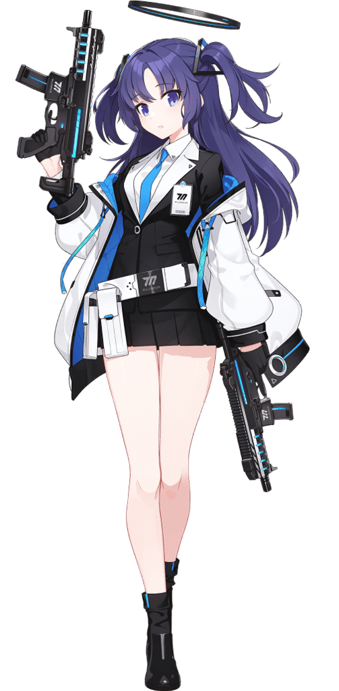
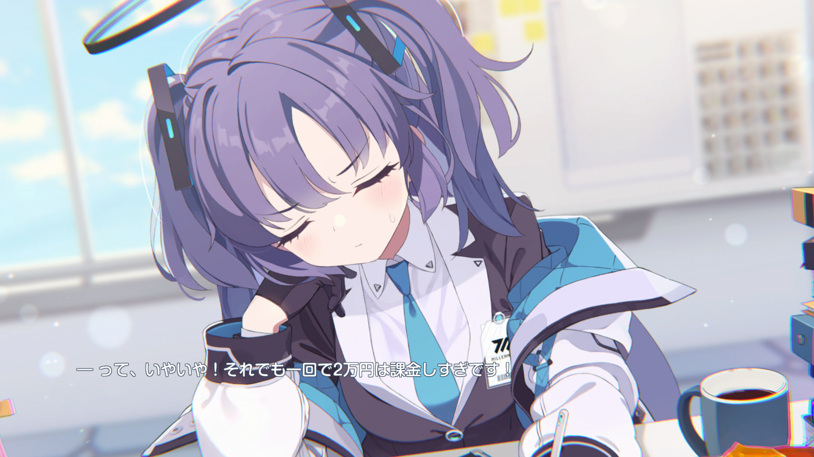
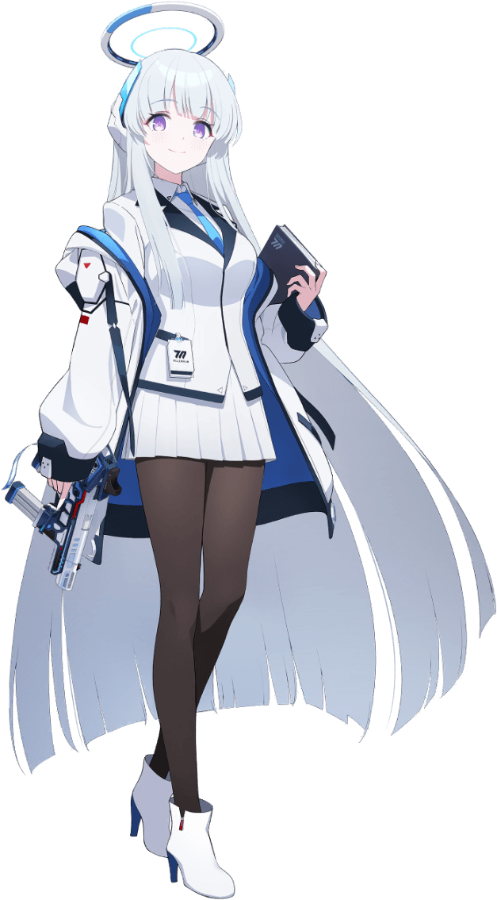
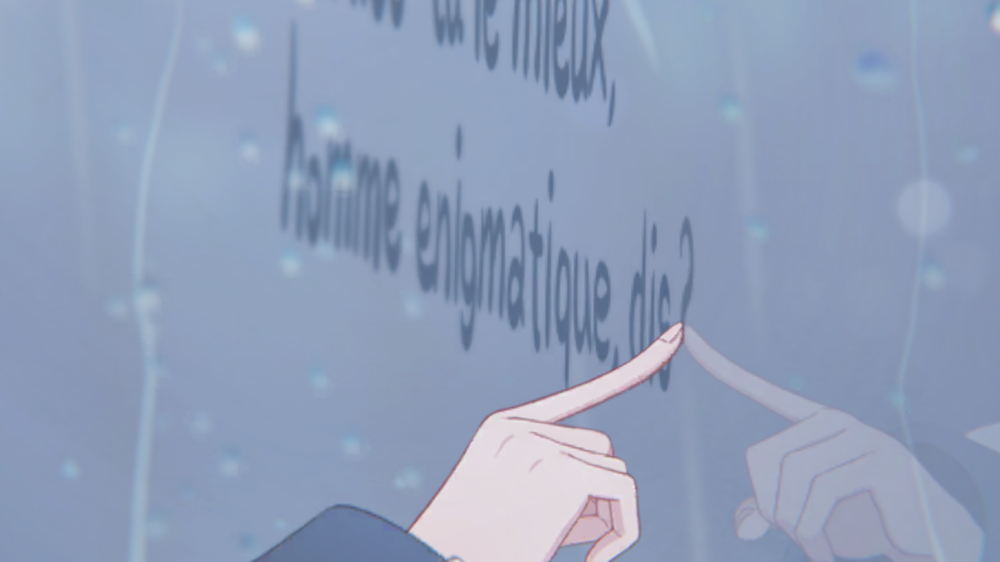
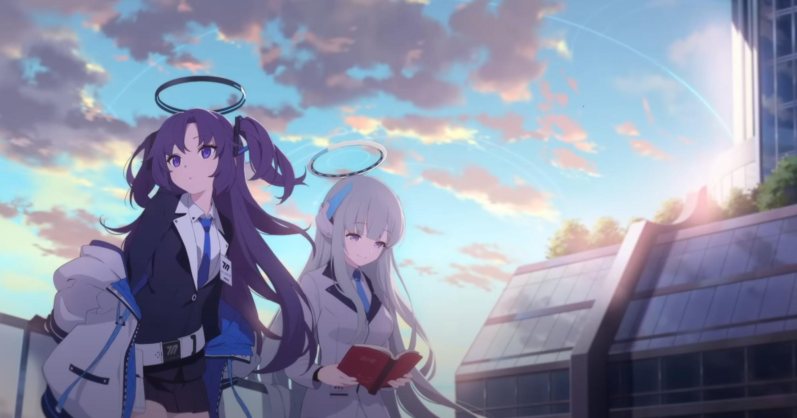

# ノアユウの話

ブルーアーカイブには一生イチャコラしている女たちがおり、代表的な例にノアユウと呼ばれる二人組が存在している。

それぞれのユウカ、ノアのキャラクタの説明と、二人の絡みがどんな感じなのかを記載する。

## 早瀬ユウカ

### 概要

[星2/ユウカの詳細・評価 - ブルーアーカイブ（ブルアカ）攻略 Wiki (wikiru.jp)](https://bluearchive.wikiru.jp/?ユウカ)

-   年齢：16歳
-   身長：156cm
-   趣味：計算

プレイヤーとしての存在である「先生」が初めて出会うキャラクタ。

ミレニアムサイエンススクール所属の2年生であり、生徒会セミナーにて会計業務を務める。理性・論理・合理・計算と言った要素に基き行動する性格。

### 詳細

ゲームの最初に現れるユウカ、ハスミ、チナツ、スズミの四人のうち、タンク役として先頭を張る人物。JHP弾が直撃しようと「痛い！」ぐらいで済むとんでもないキヴォトスと言う世界を案内してくれる。

会計と言うだけあり、帳簿などが得意。プレイヤーたる先生に浪費癖があり、家計簿もつけていないと聞いたユウカが先月の領収書を全て確認して代わりにつけてくれている場面が上記のメモリアルロビー（一枚絵）である。
インターネット上では確定申告を手伝ってくれる女として名を馳せているが、多分本当にしてくれる。

冷酷な算術使いとして（主にゲーム開発部に）恐れられ、ヴェリタスというハッカー組織に体重100kgと健康診断の記録を書き換えられた挙げ句データを流出させられ、定期的に爆発するミレニアムの校風による後片付け費用の担当をさせられていたり、最高の頭脳たる人物が設計した装置に多額の資金と時間を投入した結果何一つ得られなかったりする。かなりの苦労人かつワーカホリック気味な立ち位置。

また、初期設定のパスワードをそのまま使っていたため学内サーバをハッキングされたり、一緒に作業中にちょっと居眠りしてしまったり、「計算通り、かんぺき～♪」のようにちょっとふにゃふにゃしたセリフがあるなど、案外抜けている。なんだこのかわいい生物。~~ユウカちゃんかわいい♪~~

### 小ネタ

-   設定上両利き。そのためかサブマシンガン（ロジック&リーズン）を二丁持ちで使っている。
    -   ミレニアムサイエンススクールのC&C所属、美甘ネルさんも二丁サブマシンガン持ちかつ、銃の基礎モデル(SIG MPX)が同じと言う共通点がある。
        -   ユウカの所持しているモデルはバレルが短縮されているバリエーション。
-   何かと太ももが話題になる（？）が、実際ベータ版の時は今よりSDキャラクタの太ももが太かったらしい。

## 生塩ノア

### 概要

[星3/ノアの詳細・評価 - ブルーアーカイブ（ブルアカ）攻略 Wiki (wikiru.jp)](https://bluearchive.wikiru.jp/?ノア)

-   年齢：16歳
-   身長：161cm
-   趣味：読書・暗唱

『ON YOUR MARK @MILLENNIUM　～キヴォトス晄輪大祭(こうりんたいさい)～』にて2022年に実装されたキャラクタ。名字は生塩(うしお)と読む。

ミレニアムサイエンススクール所属の2年生であり、生徒会セミナーにて書紀を務める。セミナーの記録や、ミレニアムの生徒の開発製品の特許の鑑別・登録なども担当しており、優れた記憶力を持つ。

### 詳細

基本、かなり真面目で職務に忠実。晄輪大祭(体育祭)ではユウカの事を気遣い、代わりに業務を済ませるなどとても仕事ができる。

また、人をからかうのが結構好きな一面があるらしく、先生やユウカがよくからかわれている。例えば、少し意地悪なクイズを出して間違える事に先生のコーヒーを飲んだり、事あるごとに「ユウカちゃんかわいい♪」と言い出したりする。

絆エピソードやセリフなどで詩的な言い回しを用いることがあり、

「私の好きなある古い詩の一部」として

>   Qui aimes-tu le mieux, homme énigmatique, dis ?
>
>   君は誰を一番愛するのか？ 謎の人よ、聞かせてくれ
>   (訳:村上菊一郎)

と、シャルル・ボードレールの詩、異邦人(L’etranger)の一文を引用する一面もある。
本人も詩集を書き、ミレニアムプライスという大会での優勝経験もあるが、受賞理由はミレニアム最高の不眠症に対する治療法としての評価であり、「読んではくださるのに、きちんとした感想を言ってくれないんですよね……不思議です。」との言及などもある。文学的な面ではミレニアム生でも随一のようだ。

基本的に全方位にスキがなく、余裕が崩れない。個人的には彼女のこを絶対的捕食者として認識している。

### 小ネタ

-   ブルアカではよくあることだが、ティザーPVに現れているが長らく実装されていなかったキャラの一人。
    
    [【ブルーアーカイブ -Blue Archive-】ティザーPV - YouTube](https://www.youtube.com/watch?v=0KFPtliRn_4)
    -   ティザーPVは2020年7月、ゲーム実装日は2022年9月末ごろ。2年以上経っている。
    -   ノアが持つ本には「悪の華」と書かれており、これもシャルル・ボードレールの詩集の名前である。
    
-   ノアの持つ銃は東京マルイによるデザイン。FLUX MP17がモチーフとなっているが、コンバージョン元になった銃はマルイのハイキャパ エクストリーム。
-   絆エピソードは「セミナー書紀ノアの～」から始まるタイトルで統一されている。

## ノアユウ

（加筆予定メモ）

初登場

ユウカ→ノアは「ノア」、ノア→ユウカは「ユウカちゃん」

ノアの発言

>   ユウカちゃんは感情表現がとても豊かで、一緒にいると退屈しません。
>   それで私はつい、彼女をからかってしまうんです……ふふっ。

お時間

セミナーコミュ

その他のお話