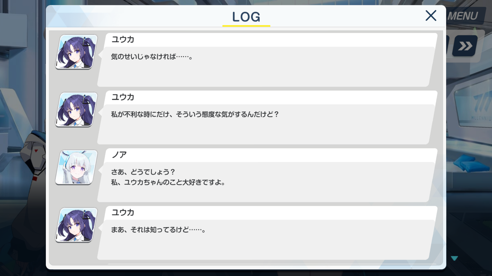
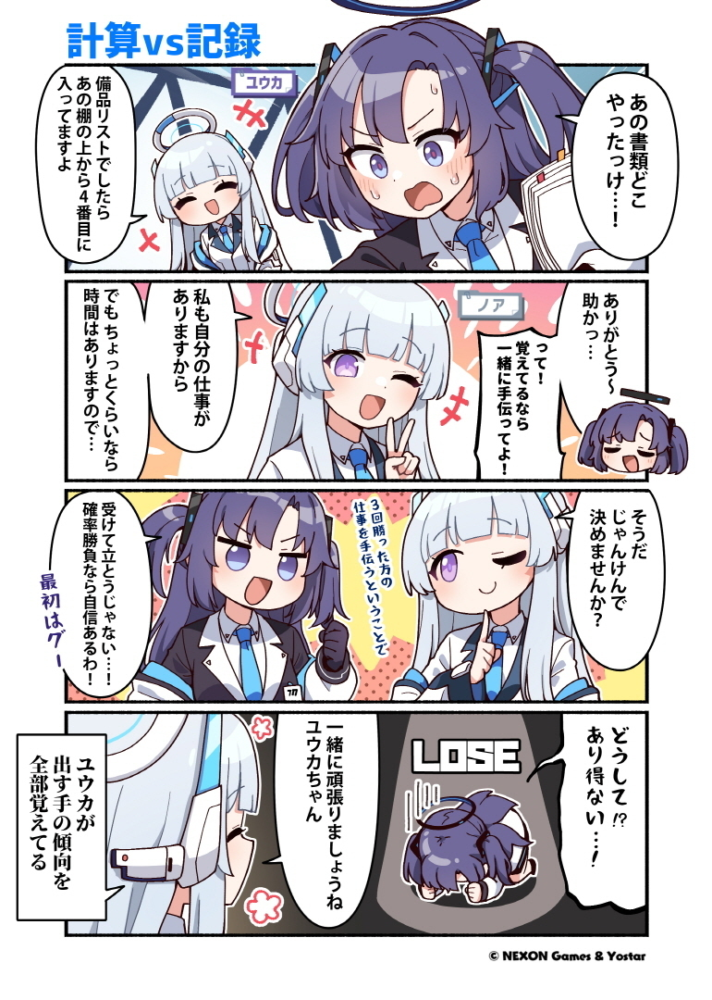
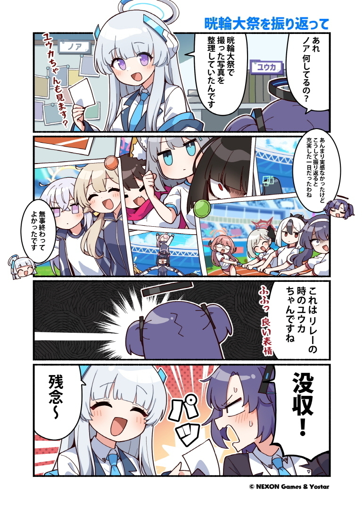

ブルーアーカイブには一生イチャコラしている女たちがおり、代表的な例にノアユウと呼ばれる二人組が存在している。

それぞれのユウカ、ノアのキャラクタの説明と、二人の絡みがどんな感じなのかを記載する。

## 早瀬ユウカ

### 概要

[星2/ユウカの詳細・評価 - ブルーアーカイブ（ブルアカ）攻略 Wiki (wikiru.jp)](https://bluearchive.wikiru.jp/?ユウカ)

-   年齢：16歳
-   身長：156cm
-   趣味：計算

プレイヤーとしての存在である「先生」が初めて出会うキャラクタ。

ミレニアムサイエンススクール所属の2年生であり、生徒会セミナーにて会計業務を務める。理性・論理・合理・計算と言った要素に基き行動する性格。

### 詳細

ゲームの最初に現れるユウカ、ハスミ、チナツ、スズミの四人のうち、タンク役として先頭を張る人物。JHP弾が直撃しようと「痛い！」ぐらいで済むとんでもないキヴォトスと言う世界を案内してくれる。

会計と言うだけあり、帳簿などが得意。プレイヤーたる先生に浪費癖があり、家計簿もつけていないと聞いたユウカが先月の領収書を全て確認して代わりにつけてくれている場面が上記のメモリアルロビー（一枚絵）である。
インターネット上では確定申告を手伝ってくれる女として名を馳せているが、多分本当にしてくれる。

冷酷な算術使いとして（主にゲーム開発部に）恐れられ、ヴェリタスというハッカー組織に体重100kgと健康診断の記録を書き換えられた挙げ句データを流出させられ、定期的に爆発するミレニアムの校風による後片付け費用の担当をさせられていたり、最高の頭脳たる人物が設計した装置に多額の資金と時間を投入した結果何一つ得られなかったりする。かなりの苦労人かつワーカホリック気味な立ち位置。

また、初期設定のパスワードをそのまま使っていたため学内サーバをハッキングされたり、一緒に作業中にちょっと居眠りしてしまったり、「計算通り、かんぺき～♪」のようにちょっとふにゃふにゃしたセリフがあるなど、案外抜けている。なんだこのかわいい生物。~~ユウカちゃんかわいい♪~~

### 小ネタ

-   設定上両利き。そのためかサブマシンガン（ロジック&リーズン）を二丁持ちで使っている。
    -   ミレニアムサイエンススクールのC&C所属、美甘ネルさんも二丁サブマシンガン持ちかつ、銃の基礎モデル(SIG MPX)が同じと言う共通点がある。
        -   ユウカの所持しているモデルはバレルが短縮されているバリエーション。
-   何かと太ももが話題になる（？）が、実際ベータ版の時は今よりSDキャラクタの太ももが太かったらしい。

## 生塩ノア

### 概要

[星3/ノアの詳細・評価 - ブルーアーカイブ（ブルアカ）攻略 Wiki (wikiru.jp)](https://bluearchive.wikiru.jp/?ノア)

-   年齢：16歳
-   身長：161cm
-   趣味：読書・暗唱

『ON YOUR MARK @MILLENNIUM　～キヴォトス晄輪大祭(こうりんたいさい)～』にて2022年に実装されたキャラクタ。名字は生塩(うしお)と読む。

ミレニアムサイエンススクール所属の2年生であり、生徒会セミナーにて書紀を務める。セミナーの記録や、ミレニアムの生徒の開発製品の特許の鑑別・登録なども担当しており、優れた記憶力を持つ。

### 詳細

基本、かなり真面目で職務に忠実。晄輪大祭(体育祭)ではユウカの事を気遣い、代わりに業務を済ませるなどとても仕事ができる。

また、人をからかうのが結構好きな一面があるらしく、先生やユウカがよくからかわれている。例えば、少し意地悪なクイズを出して間違える事に先生のコーヒーを飲んだり、事あるごとに「ユウカちゃんかわいい♪」と言い出したりする。

絆エピソードやセリフなどで詩的な言い回しを用いることがあり、

「私の好きなある古い詩の一部」として

>   Qui aimes-tu le mieux, homme énigmatique, dis ?
>
>   君は誰を一番愛するのか？ 謎の人よ、聞かせてくれ
>   (訳:村上菊一郎)

と、シャルル・ボードレールの詩、異邦人(L’etranger)の一文を引用する一面もある。
本人も詩集を書き、ミレニアムプライスという大会での優勝経験もあるが、受賞理由はミレニアム最高の不眠症に対する治療法としての評価であり、「読んではくださるのに、きちんとした感想を言ってくれないんですよね……不思議です。」との言及などもある。文学的な面ではミレニアム生でも随一のようだ。

基本的に全方位にスキがなく、余裕が崩れない。個人的には彼女のこを絶対的捕食者として認識している。

### 小ネタ

-   ブルアカではよくあることだが、ティザーPVに現れているが長らく実装されていなかったキャラの一人。
    
    [【ブルーアーカイブ -Blue Archive-】ティザーPV - YouTube](https://www.youtube.com/watch?v=0KFPtliRn_4)
    -   ティザーPVは2020年7月、ゲーム実装日は2022年9月末ごろ。2年以上経っている。
    -   ノアが持つ本には「悪の華」と書かれており、これもシャルル・ボードレールの詩集の名前である。
    
-   ノアの持つ銃は東京マルイによるデザイン。FLUX MP17がモチーフとなっているが、コンバージョン元になった銃はマルイのハイキャパ エクストリーム。
-   絆エピソードは「セミナー書紀ノアの～」から始まるタイトルで統一されている。

## ノアユウ

### 概要

9月末のイベント「ON YOUR MARK @MILLENNIUM　～キヴォトス晄輪大祭(こうりんたいさい)～」の開催が始まり。イベントストーリーにおいてノアが登場し、紹介された。

この時、呼び方がユウカ→ノアは「ノア」、ノア→ユウカは「ユウカちゃん」呼びであることが分かった。

以下は基本的にノアとユウカが互いに話しかけている場面などのセリフを抜き出したものになる。

### イベントストーリー

(加筆予定)

ノアのイベントボイスには一部ユウカに対しての言及がある。[イベント「ON YOUR MARK @MILLENNIUM　～キヴォトス晄輪大祭～」攻略まとめ - ブルーアーカイブ（ブルアカ）攻略 Wiki (wikiru.jp)](https://bluearchive.wikiru.jp/?イベント27_ON+YOUR+MARK+@MILLENNIUM　～キヴォトス晄輪大祭～#NoaVoices)より抜粋。

>   タップ時4
>   ユウカちゃんが目覚めたら、きっと小言の嵐でしょうね。 ふふ…ユウカちゃんの慌てる姿、今から楽しみです。

### 個人ボイス・絆ストーリー

(加筆予定)

ホームでの個人ボイスにおいてもノアからユウカに対する言及がある。[星3/ノアの詳細・評価 - ブルーアーカイブ（ブルアカ）攻略 Wiki (wikiru.jp)](https://bluearchive.wikiru.jp/?ノア) より抜粋。

>   雑談4
>   ユウカちゃんは感情表現がとても豊かで、一緒にいると退屈しません。
>   それで私はつい、彼女をからかってしまうんです……ふふっ。
>
>   カフェ3
>   ふふ、この光景、ユウカちゃんにも見せてあげたいです。

### グループストーリー・セミナー

[ブルーアーカイブ公式Twitter](https://twitter.com/Blue_ArchiveJP/status/1575017497752846336)にて上述のイベント開始時に合わせてセミナーのグループストーリーが追加された。

ミレニアムサイエンススクールにおける予算審議会におけるドタバタと、セミナーと言う組織の存在理由に繋がる「千年問題」に関しての言及なども含まれる。

#### 価値の証明(1)

>   ミレニアムにユウカちゃんみたいな会計がいて良かったなって。

からかっているようにも取れるが、恐らく結構本心から言っている言葉に見える。

>   気のせいじゃなければ……私が不利な時にだけ、そういう態度な気がするんだけど？
>
>   さあ、どうでしょう？
>   私、ユウカちゃんのこと大好きですよ。
>
>   まあ、それは知ってるけど……。

ほへ………………

#### 価値の証明(2)

>   確か昨日、運用してたファンドが大暴落してお金が無いって……。

ノアはユウカが様々資金運用している部分のお話を聞いたりしていることがあるらしい。

>   何だかやる気満々みたいですし、そうしましょうか？
>   ……面白そうですし♪

>   ふふっ、楽しみですねえ？

からかい癖が強いこの女……

#### 価値の証明(3)

>   ノアが助けてくれなかったら、きっと完成する前に挫折してたわ。ありがとね。
>
>   いえいえ、感謝されるようなことでは。
>   こんな面白そ――
>   おっといけない。
>   セミナーの一員として、ミレニアムの技術と可能性のためですから。

性格が悪い！！！！！（褒め言葉）

>   これから先、先生との関係がどうなるか――とか？
>
>   そ、そんな個人的な質問を、こんな風に聞けるわけないでしょ！？
>   せっかくお金をかけて作った貴重な装置なんだから、もっとこう、公的なことに……！
>
>   気になること自体は否定しないんですね？
>
>   ああもう……！

一生先生でダシ取ってくる。

>   ちょっと待って……
>   ノア、その言い方……もしかしてあなた、最初から気づいてたんじゃ……？
>
>   まあ、確信はありませんでしたが。
>
>   じゃ、じゃあどうして言ってくれなかったの！？
>
>   どうしてって……。
>   ……聞かれてませんし？
>
>   ……ノアぁ！！

そらそう。

#### 余談

ノアユウとは関係ないが価値の証明(2)では

>   ヒマリ部長個人に対しては支給するなとリオ会長が……。

と、リオ会長がヒマリのことを名指ししている。会長そういうとこだぞ……

また、価値の証明(3)ではヴァリタスのチヒロ、ヒマリの会話が挟まる。ヒマリも良い性格をしている（褒め言葉）上にチヒロのことを「チーちゃん」と呼ぶなど、こちらもこう、味がすごい。

### 先生、ちょっとお時間いただけますか？

[先生、ちょっとお時間いただけますか？ - YouTube](https://www.youtube.com/playlist?list=PLYq4yLvct07nrKLfAWL1FtwHCbsUpL9W_)

ユウカと先生がお時間いただくYoutubeの企画。60秒の動画で、最初はユウカのみが登場するが、2クール目となる13話以降からはノアも直接登場することがある……と言うか、2クール目だと18,24以外は皆勤である。

[先生、ちょっとお時間いただけますか？#9 - YouTube](https://www.youtube.com/watch?v=WlHggB5PVmg)

>   会長はリオ先輩、それに私に、ノアに……

[先生、ちょっとお時間いただけますか？#12.5 - YouTube](https://www.youtube.com/watch?v=IETrcYN_4_U)

[先生、ちょっとお時間いただけますか？#13 - YouTube](https://www.youtube.com/watch?v=VJgQ0zFapTs)

ノアの3Dモデルが公開される

>   ユウカちゃん可愛い♪

[先生、ちょっとお時間いただけますか？#14 - YouTube](https://www.youtube.com/shorts/8k6z0N_UbDE)

[先生、ちょっとお時間いただけますか？#15 - YouTube](https://www.youtube.com/watch?v=WTiHiJae4NA)

>   ユウカちゃんの真似です♪

[先生、ちょっとお時間いただけますか？#16 - YouTube](https://www.youtube.com/watch?v=3HmWe968CLA)

>   ユウカちゃんも楽しまないとダメですよ？

[先生、ちょっとお時間いただけますか？#17 - YouTube](https://www.youtube.com/watch?v=bCxM6PRYpWQ)

>   ユウカちゃーん！

[先生、ちょっとお時間いただけますか？#19 - YouTube](https://www.youtube.com/watch?v=sRFts-17s00)

>   っんあ…ノア、そこ効く…！

[先生、ちょっとお時間いただけますか？#20 - YouTube](https://www.youtube.com/watch?v=zgDLBy_rK8I)

>   私は良いですけど、ユウカちゃんが嫉妬しちゃいます♪

[先生、ちょっとお時間いただけますか？#21 - YouTube](https://www.youtube.com/watch?v=Vm9OCnUtH5U)

>   ユウカちゃんタイマーってことですね？
>
>   ユウカちゃんの声が流れる目覚まし時計とか良いかもしれませんね？
>
>   私は欲しいですよ？

[先生、ちょっとお時間いただけますか？#22 - YouTube](https://www.youtube.com/watch?v=TqUjEP6mFaI)

>   あら？ユウカちゃん？？
>
>   ごめんねーユウカちゃん♪

[先生、ちょっとお時間いただけますか？#23 - YouTube](https://www.youtube.com/watch?v=krrj7_b4Tzg)

>   ユウカちゃん一人に頼るのは気が引けるようでしたら私も頼ってくださいね？

[先生、ちょっとお時間いただけますか？クリスマスなので！ - YouTube](https://www.youtube.com/shorts/E5rZwSZAgYk)

[先生、ちょっとお時間いただけますか？#25 - YouTube](https://www.youtube.com/watch?v=yNXSUtr1xPY)

開始前から手を繋いでいる。

>   ノア♪
>
>   素直なユウカちゃんも可愛いですね、先生♪

### ぶるーあーかいぶっ！

公式による四コマ漫画シリーズ。イベントに合わせてノアユウが登場した漫画が存在する。

[【ぶるーあーかいぶっ！】第84話](https://twitter.com/Blue_ArchiveJP/status/1578233716253798400)

>   ユウカが出す手の傾向を全部覚えてる

やばい。

[【ぶるーあーかいぶっ！】第89話](https://twitter.com/Blue_ArchiveJP/status/1590917312588046337)

### その他

#### 新年のご挨拶

[【ブルアカ】ユウカとノアからの新年のご挨拶2023 - YouTube](https://www.youtube.com/watch?v=ZXwr6pu4saQ)

お時間いただけますか？とは別枠で二人は新年の挨拶をしている。

>   ユウカちゃんも変わりないですか？
>
>   （ボディタッチ）
>
>   ひゃっ！？ ちょっと！ ノア！？

#### アイドル衣装

2022年のエイプリルフール企画ではユウカがアイドル衣装に身を包むのだが、[ブルーアーカイブ公式Twitter](https://twitter.com/Blue_ArchiveJP/status/1509734872989937671)によるとこれは

>    ノアさんがノリノリで企画にOK出しちゃって、出ることになってしまったペロ～

とのこと。~~ユウカちゃん可愛い♪~~

## まとめ

-   ユウカちゃんは可愛い
-   ノアの立ち位置はすごい
-   ノアユウはとんでもない

~~いかがでしたか？~~ ともかくお二人が元気でいてくれたら嬉しいな。