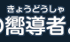
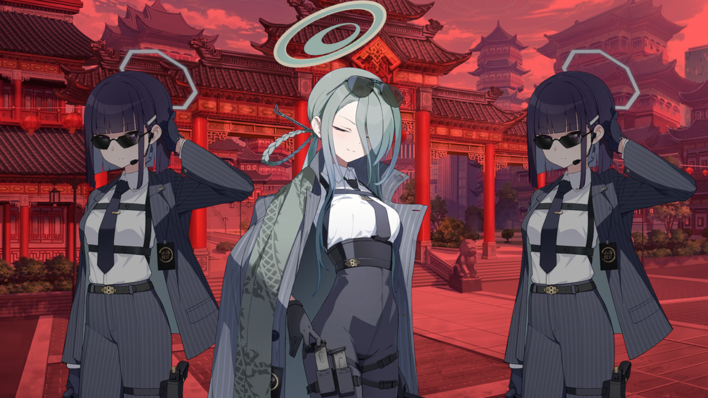
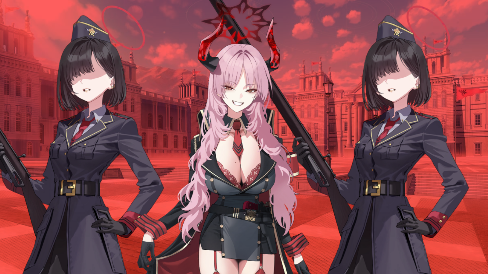
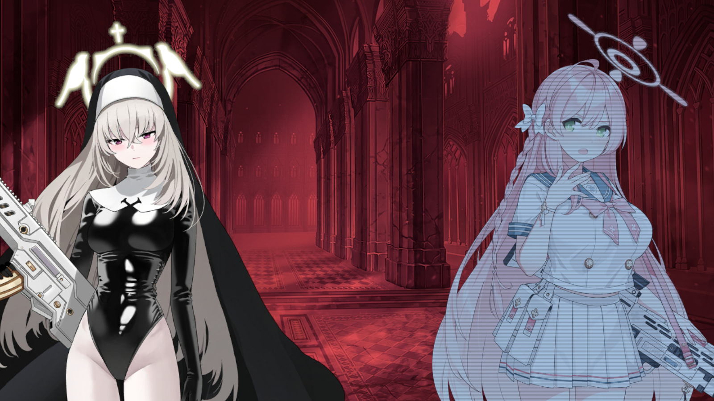

**下記はブルーアーカイブ・メインストーリー最終編のネタバレが含まれます。**

## 第一章

### 全体の流れ

1.   プロローグ

2.   破局

     1.   百鬼夜行による色彩の解釈
     2.   ゲマトリアによる色彩の計画
     3.   先生の見るクロコの夢
     4.   セイアの最後の予知夢
     5.   連邦生徒会の「終焉」の認知

3.   日常の亀裂

     1.   アビドス
          1.   PMC兵力の移動
     2.   ミレニアム
          1.   Key、もといケイの検査
          2.   リオの残したデータによる未曾有の危機

4.   日常の亀裂

     1.   トリニティ
          1.   聖徒会長の残した礼装をサクラコが引き継ぎ
          2.   ミカの判決決定
          3.   アズサによるペロロジラ人形の発見（偽物）

5.   日常の亀裂

     1.   SRT
          1.   ハチの巣を焼き払って焼き鳥を得る
          2.   カヤによる「始まり」の認識
     2.   ゲマトリア
          1.   ベアトリーチェの処刑
          2.   色彩への対抗手段

6.   前兆

     1.   リンによる過去の夢
     2.   謎のエネルギー体の発見
          1.   アビドス砂漠・遊園地・ミレニアム郊外・トリニティゲヘナの境界・ミレニアムの新しい都市・サンクトゥムタワー中心
     3.   アオイとリンによる連邦生徒会の紛争
          1.   カヤによる暗躍

7.   非常対策委員会の招集

     1.   参加：アビドス生徒会・シスターフッド・救護騎士団・ティーパーティー・万魔殿・百鬼夜行？・レッドウィンター？・シャーレ
     2.   不参加？：風紀委員会・セミナー
     3.   カイザーPMC
          1.   ジェネラルとプレジデントの存在
          2.   カヤの始末・ゲマトリアとの離別
          3.   カイザーコーポレーションによる連邦生徒会の乗っ取り計画
     4.   先生の拘束

8.   光の到来

     1.   アビドス
          1.   シロコの記憶喪失
     2.   カイザーPMCの砂漠への移動
          1.   「不思議な光が見える……黒……いや、虹……？」
     3.   アロナによる先生の保護
     4.   **色彩の到達?**
     5.   シロコと「何か(超古代兵器)」の遭遇

9.   衝突(1)

     1.   シッテムの箱の電源低下
     2.   カンナ・生活保護局による先生の救助
          1.   ヴァルキューレのカイザーコーポレーションによる支配
     3.   カイザーPMCによる連邦生徒会の襲撃(6時間前)
          1.   サンクトゥムタワーの掌握・D.U.戒厳令
          2.   非常対策委員会の指揮系統の崩壊、リンの不信任決議案の決定

10.   衝突(2)

      1.   カイザーPMCにより連邦生徒会の襲撃・サンクトゥムタワーの掌握へ
      2.   カンナによるシッテムの箱の奪還
      3.   アロナとのコネクションの回復・指揮系統の復活

11.   脱出(1)

      1.   戦闘：キリノ・フブキ

12.   脱出(2)

      1.   SRTによる先生の救護

13.   シャーレ奪還作戦(1)

      1.   リンのシャーレへの幽閉
      2.   クラフトチェンバーの機能

14.   シャーレ奪還作戦(2)

      1.   ゲマトリア
           1.   色彩の観測
           2.   箱舟の優先、カイザーの優先順位の低下
           3.   クロコの登場
      2.   SOF（カイザーの特殊部隊）、普通に殲滅される

15.   沈みゆく物語

      1.   通信復旧

      2.   支援要請

           1.   セイア・サクラコ・ミカ・ナギサ・ユウカ・ハナコ・ヒマリ・リン・アヤネ・ホシノ・ノノミ・セリカ
                1.   シロコの消失
           2.   FOX小隊によるカイザーPMCの制圧

      3.   ゲマトリアによる宣告

           1.   「ゴルコンダ」の消失、「フランシス」・デカルコマニーとともに見守る者。

           2.   >   一つのジャンルを掲げていたが故に、「先生」が主人公でいる事ができた。
                >
                >   物語であったから、あなたは無敵だった。――これは**そういう**物語だった。
                >
                >   しかし今となっては……
                >
                >   ――この物語は、覆された。
                >
                >   脈略、構成、ジャンル、意図、解釈……すべてが破壊され――
                >
                >   その意味は絡み合い、混ざり、撹拌され――統制できない程に褪せてしまった。
                >
                >   先生よ――
                >
                >   これまでの物語は全て忘れるが良い。
                >
                >   これからお前の身に起こることは、最早そのような物語ですらないのだから――
                >
                >   主人公も、悪役も、事件も、葛藤も無く――
                >
                >   全てが分解され、縺れあい――
                >
                >   脈略も、構成も、必然性も無くなってしまった……作為的に作られた世界。
                >
                >   そうして――果ては意味を失い、力が暴れ回るだけの――理解不能で不受理な世界へと。
                >
                >   嗚呼、そうだ――元より、この世界はそのように存在していた。
                >
                >   我々は皆、それを忘れていただけ。
                >
                >   これが――もう物語でなくなったとするならば、お前はもう何者でもない。
                >
                >   学園と青春の物語は、幕を下ろした。
                >
                >   覆され、解体されてしまったジャンルで、お前の価値は揺らぎ、地に落ち、無に等しいものとなる！
                >
                >   しかして、始めるのだ。物語ではない――

                >   "違う。"
                >
                >   "敵対し、裏切り、覆ってしまった……沈みゆく物語だとしても、"
                >
                >   "物語と呼ぶのに相応しくない、歪な創作だとしても"
                >
                >   "そんなことは、どうでもいいんだ。"
                >
                >   "ジャンルの解体なんて好きにすればいい。"
                >
                >   "宇宙戦艦や巨大ロボットが登場したって構わないんだよ。"
                >
                >   "どんな未来であろうと、私たちは乗り越えていくのだから。"

                >   であれば、それを見守るとしよう。先生――いや、主人公よ。
                >
                >   絶望を――破局を迎え――そうして、結末へと走り出すエンディングを！

           3.   キヴォトスの生徒全員に対してのメッセージ送信

           4.   黒服

                1.   >   「色彩」はすでに「名もなき神」と接触した後でしたか……
                     >
                     >   嗚呼、狼の神の裏側は――そういうことだったのですね。
                     >
                     >   命ある全てを常世へと導く、死の神(アヌビス)……
                     >
                     >   それがあなたの神秘の裏側、恐怖であった、と。

                     >   これより相対するは――死の神「アヌビス」が引き寄せた、「色彩」のきゅうどうしゃ()

### 色彩とは

  「神秘」と「恐怖」を反転させるもの？ キヴォトス人にとって、色彩は致死の毒であり、本質を代償に失うことでしか助からない。

キヴォトスにおいて本来現れるはずのないものだが、ベアトリーチェにより、色彩はキヴォトスを発見する。ゲマトリアもこれは予想していない。

シロコはこの色彩に触れ、死の神アヌビスとしての恐怖を得た、これが捻れた世界の一つだったのだろうか。

### キヴォトスの終焉

セイアによる予知夢の内容。

「天から巨大な塔が飛来し、虚空が緋色に染められ、不吉な塔は、まるで悲鳴を上げるように鳴動し、この世界を少しずつ削り取って……そうして、黒い光が天から舞い降り……世界が終焉に傾いていく……。」

先生とセイアの見た夢の内容はクロコが銃を向け、先生の生が終わる場面。

## 第二章

1.   色彩の求道者(漢字違い)

     1.   各学園の反応
          1.   ゲヘナ
               1.   ヒナ・アコ
          2.   ミレニアム
               1.   ユウカ
               2.   ノア(待機)
               3.   リオ会長の不在
          3.   トリニティ
               1.   ハナコ
               2.   ナギサ・サクラコ・ミネ
          4.   便利屋68
               1.   全員
               2.   カヨコ
          5.   クロノス
               1.   塔が報道される
     2.   ゲマトリア
          1.   黒服による「ゲマトリアの壊滅」
          2.   「色彩」の狼の神との接触による死の神への反転
          3.   サンクトゥムタワーの一種「塔」による色彩の光の伝搬
          4.   「秘儀」と「検証結果」を奪うためとの予想
          5.   色彩の求道者(漢字違い)の「プレナパテス」の存在
          6.   ユスティナ・PMC・Divi:Sionの出現
          7.   黒服の忠告「そのカードを乱用すれば――あなたは私たちと同じ結末を迎える事になりますよ、先生。」
     3.   戦闘

2.   作成会議

     1.   過去・記憶喪失のシロコ
          1.   2年生ホシノ・マフラーを授ける
          2.   アビドス対策委員会・シャーレの招集に応じる
     2.   シャーレ
          1.   リン
          2.   カヨコの到着
          3.   ユウカ
          4.   アコ
          5.   ハナコ
          6.   アヤネ
     3.   作戦会議
          1.   「人々を狂気に陥れる光」である「色彩」
               1.   宇宙からの光だろうね（意見）
               2.   エンジニア部による精神変調作用の検出
               3.   特異現象捜査部とトキによるサンクトゥムタワーを守る存在の検出
                    1.   3番目の預言者：ビナー
                    2.   スランピアのミメシス：シロ＆クロ
                    3.   聖徒の交わり：ヒエロニムス
                    4.   4番目の預言者：ケセド
                    5.   8番目の預言者：ホド
               4.   ティーパーティー・風紀委員会・救急医学部・レッドウィンター事務局・陰陽部・修行部・お祭り運営委員会・錬丹術研究会・梅花園・玄武商会・生活安全局・公安局・特異現象捜査部
                    1.   以上が治安維持に回る
                    2.   「その代わり、チナツは救急医学部に帰ってきてください」
                         「……冗談です」
               5.   虚妄のサンクトゥムの作戦開始
               6.   クズノハ
                    1.   セイアが遭遇した生徒だが、百鬼夜行では都市伝説的存在
                    2.   百鬼夜行連合学院設立前の時代の大預言者
                    3.   現時点で百花繚乱（生徒会？）のみしか存在を知らないが、百鬼夜行では委員長・副委員長の不在により廃部予定となっている

3.   作戦準備(1)

     1.   第1サンクトゥム・ビナー
          1.   第1部隊：対策委員会
          2.   第2部隊：便利屋68
     2.   第2サンクトゥム・ケセド
          1.   特異現象捜査部：エイミ
          2.   C&C
          3.   正義実現委員会：ツルギ・イチカ
     3.   第3サンクトゥム・シロ&クロ
          1.   ゲーム開発部
          2.   SRT・RABBIT小隊
          3.   風紀委員会・ヒナ
     4.   シャーレコントロール0
          1.   ノア・マキ

4.   作戦準備(2)

     1.   第4サンクトゥム・ヒエロニムス
          1.   アリウススクワッド
          2.   シスターフッド
          3.   救護騎士団
          4.   作戦担当：ハナコ
     2.   第5サンクトゥム・ホド
          1.   ヴェリタス
          2.   エンジニア部
          3.   温泉開発部
          4.   セミナー：コユキ
     3.   第6サンクトゥム（D.U.中心）
          1.   公安局
          2.   給食部
          3.   美食研究会
               1.   水族館をたぶん強盗している。
          4.   偵察隊：補習授業部
     4.   クズノハ捜索
          1.   忍術研究部
               1.   百鬼夜行・最北端「大雪原」
               2.   百花繚乱の委員長捜索
          2.   万魔殿
               1.   マコトさまなにしてんの？

5.   作戦準備(3)

     1.   全ての準備が整い、開戦

6.   第1サンクトゥム「アビドス砂漠」

7.   「山海経」自治区防衛

     1.   門主キサキと執行部長ミナ初登場
     2.   
          1.   かわいいね
          2.   ゴッドマーザーと言う映画があるらしい

8.   「レッドウィンター」自治区防衛

     1.   事務局・工務部
     2.   227号特別クラス・知識解放戦線

9.   第２サンクトゥム「ミレニアム郊外の閉鎖地域」

     1.   ツルギ先輩かっけ～

10.   「百鬼夜行」自治区防衛

      1.   カホ・ツバキ・チセ・フィーナ・シズコ+カエデ・ミモリ

11.   「ゲヘナ」自治区防衛

      1.   サツキ登場
           1.   
           2.   **とんでもない女が来てますよ！**
                1.   ブルアカをプレイするeスポーツキャスターの発言たぶんこう
      2.   エリカ・キララ登場
           1.   サツキの「NKウルトラ計画」とか言う催眠術らしいなにか
                1.   糸にコインぶら下げるらしい。普通に全然意味なくてウケられている。
                2.   あと風紀委員会にも効かない。
                     1.   万魔殿、半分以上アホしかいないのでは。

12.   第3サンクトゥム「廃墟化した遊園地」

      1.   アリス・ヒナ・アバンギャルド君を含め発進

13.   「トリニティ」自治区防衛(1)

      1.   正義実現委員会
      2.   自警団
      3.   放課後スイーツ部
      4.   ティーパーティ

14.   「トリニティ」自治区防衛(2)

      1.   コハル
           1.   立派だよ  えらいよ  ほんとに
           2.   孤立無援でも逃げずに守れるの  正義実現委員会の名にあまりにもふさわしいよ
      2.   ミカ
           1.   「……私の大切な**お友達**に、一体何してるの？」

15.   第4サンクトゥム「カタコンベ内バシリカ」

      1.   救護騎士団

      2.   アリウススクワッド

      3.   サクラコのユスティナ聖徒会の衣装（例のハイレグ）

           

           「それが……「覚悟」なのですか！？」

           「その、**破廉恥**な衣装が！？」

           「それが本当に！シスターフッドが引き継いだ、聖徒会の意志なのですか！？」

           「その……つまり、これから、シスターのみなさんにその衣装を着用させるということなのでしょうか！？」

           「そ、そう……なのですか！？」

           「わ、私は……そのような格好は……あう……。」

           「え、ええっと、いったい何をおっしゃっているのか……！？」

           「それが本当に……サクラコさんの覚悟だとおっしゃるのですか！？」

           「サクラコさん、正直におっしゃってください。私すごく気になっているのです。中に下着は？ いえ――よく考えれば、物理的に存在できない……なるほど。理解しました。」
           「つまりサクラコさんは今――その薄い布一枚でここに居るということなのですね！！」

           「い、いったい何をおっしゃっているのでしょうか！？」

           「……。」

           「私たちの罪をお赦しください……」

      4.   引き継いだだけで罪の赦しを部下に請われてるのかわいそうすぎる。

16.   「ミレニアム」自治区防衛

      1.   エンジニア部・トレーニング部・AMAS

17.   第5サンクトゥム「要塞都市エリドゥ近郊」

      1.   セミナー(コユキ含む)
      2.   温泉部
           1.   ミレニアム自治区に温泉はないらしい。

18.   大雪原の中で

      1.   忍術研究部
      2.   マコトさま、イブキに甘すぎる
           1.   万魔殿、イブキ大好きクラブに名前変えても良い気がします
           2.   ほんとにこれだけしに来たんだ

19.   「D.U.シラトリ区」防衛

      1.   美食研究会
      2.   補習授業部：ヒフミ・アズサ
      3.   カイテンジャー
           1.   「無限回転寿司戦隊・カイテンジャー！参上！」
                「誰だ今の」
      4.   孤独なトキ

20.   最終防衛戦「シャーレ」

      1.   ヴァルキューレ
           1.   カンナさん
                1.   カツ丼食えよ……
                     カツ丼食えよ！！！！！！！！！
      2.   スケバン達およびヘルメット団（ラブ）
      3.   ワカモ
      4.   リンちゃんがんばえ～

## （その他）F.SNC攻略戦

1.   ビナー
     1.   「直撃は避けて！」って言われた攻撃が直撃しても平気でいるホシノ先輩
     2.   なんならスキルの方が弱いビナーくん。
     3.   一回で倒せなくても無料で再挑戦できる決戦ビナーくん……
2.   ヒエロ
     1.   シスターフッド・アリウススクワッド・救護騎士団の合同作戦
3.   

